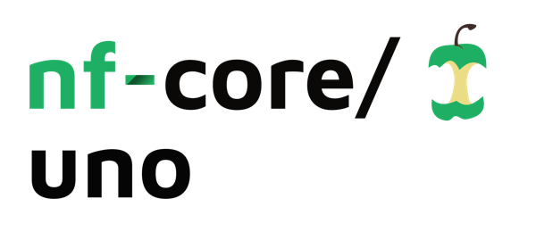

<h1>
  <picture>
    <source media="(prefers-color-scheme: dark)" srcset="docs/images/nf-core-uno_logo_dark.png">
    
  </picture>
</h1>
[](https://github.com/nf-core/uno/actions?query=workflow%3A%22nf-core+CI%22)
[](https://github.com/nf-core/uno/actions?query=workflow%3A%22nf-core+linting%22)[](https://nf-co.re/uno/results)[](https://doi.org/10.5281/zenodo.XXXXXXX)

[](https://www.nextflow.io/)
[](https://docs.conda.io/en/latest/)
[](https://www.docker.com/)
[](https://sylabs.io/docs/)
[](https://tower.nf/launch?pipeline=https://github.com/nf-core/uno)

[](https://nfcore.slack.com/channels/uno)[](https://twitter.com/nf_core)[](https://mstdn.science/@nf_core)[](https://www.youtube.com/c/nf-core)

## Introduction

**nf-core/uno** is a bioinformatics pipeline for the co-assembly, binning, and read mapping of mNGS outbreak samples from the **The UnO project** 

<!-- TODO nf-core:
   Complete this sentence with a 2-3 sentence summary of what types of data the pipeline ingests, a brief overview of the
   major pipeline sections and the types of output it produces. You're giving an overview to someone new
   to nf-core here, in 15-20 seconds. For an example, see https://github.com/nf-core/rnaseq/blob/master/README.md#introduction
-->
## Pipeline summary
UnO is an mNGS bioinformatics pipeline that supports **The UnO Project**. nf-core UnO is the second tier The UnO project which analyzes set of mNGS reads from a well-characterized outbreak. The draft UnO pipeline takes as input outbreak sets of mNGS reads. Reads are co-assembled into a single outbreak assembly and then binned into Metagenomic Assembled Genomes (MAGs). Individual mNGS reads are mapped back to MAGs to identify individual sample contributions. MAGs in common across individual mNGS reads are chosen for further analysis and characterization.   
<!-- TODO nf-core: Include a figure that guides the user through the major workflow steps. Many nf-core
     workflows use the "tube map" design for that. See https://nf-co.re/docs/contributing/design_guidelines#examples for examples.   -->
<!-- TODO nf-core: Fill in short bullet-pointed list of the default steps in the pipeline -->

1. Read QC ([`FastQC`](https://www.bioinformatics.babraham.ac.uk/projects/fastqc/))
2. Perform quality and adapter trimming on raw reads ([`Trimmomatic`](http://www.usadellab.org/cms/?page=trimmomatic))
3. Read QC on trimmed reads
4. Co-assemble mNGS reads from outbreak dataset into single outbreak assembly ([`Megahit`](https://github.com/voutcn/megahit))
5. Preparation for binning of metagenomic co-assembly with ([`Bowtie2`](http://bowtie-bio.sourceforge.net/bowtie2/index.shtml)). Outbreak co-assembly is used to create an index which individual reads are mapped to determine depth information for downstream binning tools. 
6. ([`MetaBat2`](https://bitbucket.org/berkeleylab/metabat/src/master/)) and ([`MaxBin2`](https://sourceforge.net/projects/maxbin2/)) are used to bin MAGs. 
6. Perform QC for raw reads ([`MultiQC`](http://multiqc.info/))

## Usage

> [!NOTE]
> If you are new to Nextflow and nf-core, please refer to [this page](https://nf-co.re/docs/usage/installation) on how to set-up Nextflow. Make sure to [test your setup](https://nf-co.re/docs/usage/introduction#how-to-run-a-pipeline) with `-profile test` before running the workflow on actual data.
```console
nextflow run nf-core/uno --input /path/to/UnOsamplesheet.csv -profile <conda> -c <CONFIG> --outdir <OUTDIR>
```
<!-- TODO nf-core: Describe the minimum required steps to execute the pipeline, e.g. how to prepare samplesheets.
     Explain what rows and columns represent. For instance (please edit as appropriate):

First, prepare a samplesheet with your input data that looks as follows:

`samplesheet.csv`:

```csv
sample,group,short_reads_1,short_reads_2,
SAMPLE1,UnO,/path/to/reads/SAMPLE1_1.fastq.gz,/path/to/reads/SAMPLE1_2.fastq.gz,
SAMPLE2,UnO,/path/to/reads/SAMPLE2_1.fastq.gz,/path/to/reads/SAMPLE2_2.fastq.gz,
SAMPLE3,UnO,/path/to/reads/SAMPLE3_1.fastq.gz,/path/to/reads/SAMPLE3_2.fastq.gz,
```

Each row represents a pair of fastq files (paired end).

-->

Now, you can run the pipeline using:

<!-- TODO nf-core: update the following command to include all required parameters for a minimal example -->

```bash
nextflow run nf-core/uno \
   -profile <docker/singularity/conda/institute> \
   --input samplesheet.csv \
   --outdir <OUTDIR>
```

> [!WARNING]
> Please provide pipeline parameters via the CLI or Nextflow `-params-file` option. Custom config files including those provided by the `-c` Nextflow option can be used to provide any configuration _**except for parameters**_;
> see [docs](https://nf-co.re/usage/configuration#custom-configuration-files).

For more details and further functionality, please refer to the [usage documentation](https://nf-co.re/uno/usage) and the [parameter documentation](https://nf-co.re/uno/parameters).

## Pipeline output

Current output of the draft UnO output consists of the user specified <OUTDIR> with following directories: fastqc, trimmomatic, bowtie2, Assembly, GenomeBinning, convert, multiqc, pipeline_info. 
To see the results of an example test run with a full size dataset refer to the [results](https://nf-co.re/uno/results) tab on the nf-core website pipeline page.
For more details about the output files and reports, please refer to the
[output documentation](https://github.com/uel3/nf-core-uno/wiki/Output).

## Credits

nf-core/uno was originally written by Candace Cole.

We thank the following people for their extensive assistance in the development of this pipeline:

<!-- TODO nf-core: If applicable, make list of people who have also contributed -->

## Contributions and Support

If you would like to contribute to this pipeline, please see the [contributing guidelines](.github/CONTRIBUTING.md).

For further information or help, don't hesitate to get in touch on the [Slack `#uno` channel](https://nfcore.slack.com/channels/uno) (you can join with [this invite](https://nf-co.re/join/slack)).

## Citations

<!-- TODO nf-core: Add citation for pipeline after first release. Uncomment lines below and update Zenodo doi and badge at the top of this file. -->
<!-- If you use nf-core/uno for your analysis, please cite it using the following doi: [10.5281/zenodo.XXXXXX](https://doi.org/10.5281/zenodo.XXXXXX) -->

<!-- TODO nf-core: Add bibliography of tools and data used in your pipeline -->

An extensive list of references for the tools used by the pipeline can be found in the [`CITATIONS.md`](CITATIONS.md) file.

You can cite the `nf-core` publication as follows:

> **The nf-core framework for community-curated bioinformatics pipelines.**
>
> Philip Ewels, Alexander Peltzer, Sven Fillinger, Harshil Patel, Johannes Alneberg, Andreas Wilm, Maxime Ulysse Garcia, Paolo Di Tommaso & Sven Nahnsen.
>
> _Nat Biotechnol._ 2020 Feb 13. doi: [10.1038/s41587-020-0439-x](https://dx.doi.org/10.1038/s41587-020-0439-x).
## Notices

### Public Domain Notice
This repository constitutes a work of the United States Government and is not
subject to domestic copyright protection under 17 USC § 105. This repository is in
the public domain within the United States, and copyright and related rights in
the work worldwide are waived through the [CC0 1.0 Universal public domain dedication](https://creativecommons.org/publicdomain/zero/1.0/).
All contributions to this repository will be released under the CC0 dedication. By
submitting a pull request you are agreeing to comply with this waiver of
copyright interest. 

### License Standard Notice

### Privacy Notice
This repository contains only non-sensitive, publicly available data and
information. All material and community participation is covered by the
[Disclaimer](https://github.com/CDCgov/template/blob/master/DISCLAIMER.md)
and [Code of Conduct](https://github.com/CDCgov/template/blob/master/code-of-conduct.md).
For more information about CDC's privacy policy, please visit [http://www.cdc.gov/other/privacy.html](https://www.cdc.gov/other/privacy.html).

### Contributing Notice
Anyone is encouraged to contribute to the repository by [forking](https://help.github.com/articles/fork-a-repo)
and submitting a pull request. (If you are new to GitHub, you might start with a
[basic tutorial](https://help.github.com/articles/set-up-git).) By contributing
to this project, you grant a world-wide, royalty-free, perpetual, irrevocable,
non-exclusive, transferable license to all users under the terms of the
[Apache Software License v2](http://www.apache.org/licenses/LICENSE-2.0.html) or
later.

All comments, messages, pull requests, and other submissions received through
CDC including this GitHub page may be subject to applicable federal law, including but not limited to the Federal Records Act, and may be archived. Learn more at [http://www.cdc.gov/other/privacy.html](http://www.cdc.gov/other/privacy.html).

### Records Management Notice
This repository is not a source of government records, but is a copy to increase
collaboration and collaborative potential. All government records will be
published through the [CDC web site](http://www.cdc.gov). 
